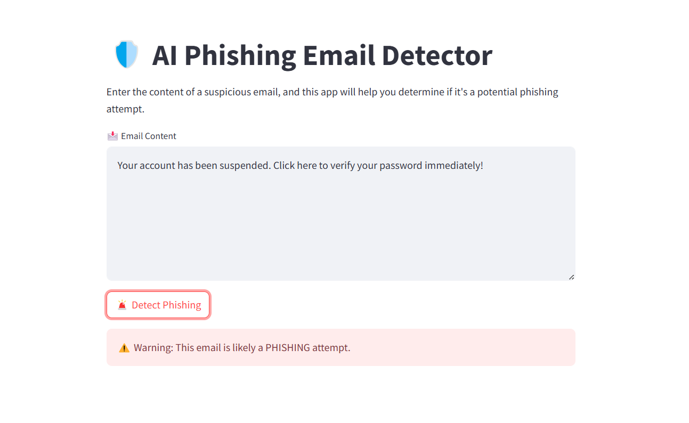
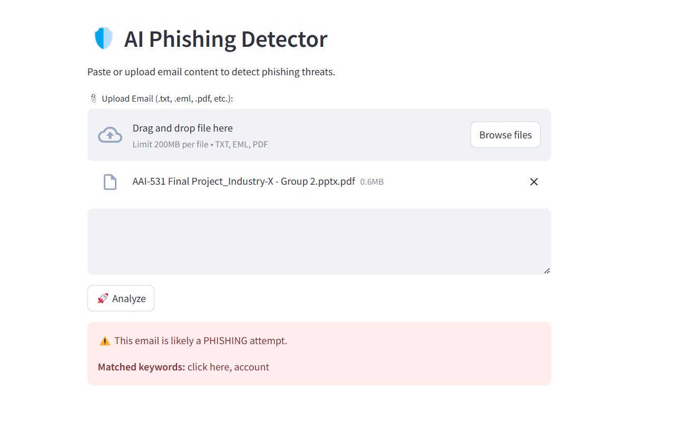

# 🛡️ AI Phishing Email Detector

[](https://ai-phishing-detector-8wtkg4vh45skksrablkq8w.streamlit.app/)

A smart and simple tool to detect phishing threats in emails using keywords, ML models, and a sleek web interface.

## 🚀 Features

- 🔍 **Detect phishing attempts** from pasted text or uploaded `.txt` / `.eml` files
- 📊 **Real-time keyword + ML detection**
- 💻 **Streamlit-based browser UI**
- 💾 **Log phishing keywords and events**
- 🎯 **Minimalist, fast, professional**
- 🔄 **New in v1.1:** Now includes **Light/Dark mode** and **upload UI!**

---

## 🖥️ Screenshot



---

## 🖼️ PDF Upload Support

You can now upload `.pdf` files to analyze for phishing threats — in addition to `.txt` and `.eml`.



## ⚙️ How to Run Locally

```bash
git clone https://github.com/Robair26/ai-phishing-detector.git
cd ai-phishing-detector
python -m venv venv
venv\Scripts\activate
pip install -r requirements.txt
streamlit run app.py


To keep this repository clean and under GitHub’s file size limits, large training files are hosted externally.

📥 Download the training dataset and ML model here:
🔗 Download from Google Drive: https://drive.google.com/file/d/1urksgoVf9CKn6FbbBu9j0RQX7HC2PaqL/view?usp=sharing

➡️ After download:

Extract the zip file

Place the contents inside a data/ folder within the project directory

You're good to go! ✅


License: 
This project is licensed under the MIT License.

### Explanation of Changes:
1. **Corrected the emojis**: Replaced `??` with proper emojis like `🛡️`, `🚀`, `📊`, etc.
2. **Updated links**: The `Streamlit App` image now has a clickable link.
3. **Formatted markdown sections**: Ensured proper headings, code blocks, and list formatting.

### To update this on your local system:
1. Open the `README.md` file.
2. Copy the updated content above.
3. Paste it into your `README.md` file.
4. Save and close the file.

### To push it to GitHub:
1. Run the following commands:

```bash
git add README.md
git commit -m "Updated README.md with correct formatting and emojis"
git push origin main

